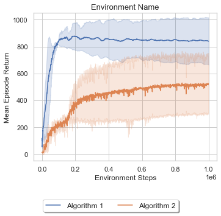

# RL Evaluation Plots
A simple Jupyter notebook to visualize the results of RL experiments stored in Tensorboard log files with Matplotlib.

## Features
- Extracting Pandas dataframes from Tensorboard log files
- Aggregation of multiple seed runs (standard deviation)
- One plot or multiple plots

## Exemplary visualizations
### One plot

### Multiple plots

## Credits
Tensorboard data extraction by: [supermariopy](https://github.com/theRealSuperMario/supermariopy)